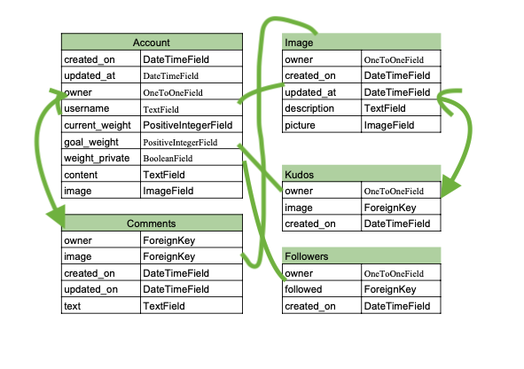
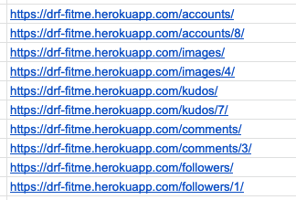

DRF FITME is a backend database built using Django Rest Framework and tailored to serve as an api for the frontend application that is built using React.
The frontend application is called FITME, this is a fitness social media platform for users to motivate each other and get healthier and happier.

The main data models on this api are:

- accounts
- images
- kudos
- followers
- comments

Esentially users on the front end application are able to register, add images, follow each other and show support by giving kudos. The images and comments models are built in a way so that users can perform CRUD funstionality(Create, Read, Edit and Delete).
Additionally users are able to search for other users or images or filter views besed on who has posted the images etc.

Please see the link to [deplyowed API](https://drf-api-sa31.onrender.com/)

See the link here fore deployed [frontend application called FITME](https://react-fitme.herokuapp.com/)

Link here for the [frontend repository on github](https://react-fitme.onrender.com)

## Table of Contents

+ [Data Models](#data-models "Data Models")
+ [Testing](#testing "Testing")
  + [PEP8](#pep-8 "PEP8")
  + [Manual Testing](#manual-testing "Manual Testing")
+ [Deployment](#deployment "Deployment")
  + [Cloning](#cloning "Cloning")
  + [Version Control](#version-control "Version Control")

# Data Models

# Testing

## Manual Testing

Manual testing was performed throughought the building process which ensured avoiding issues later on. 

This was done step by step, for example when the new model accounts was created and connected to urls and views.py, I navigated on development server, like in the exaple link below, to see if is correctly displaying in the browser. Then when the edit function was created I have navigated to development server and clicked options, to see if I can edit one of the accounts.
 The actions were repeated all the way as I was building the project.

- https://8000-lauraz15-drffitme-geap80extvu.ws-eu67.gitpod.io/accounts/3/

Complete testing was performed just before deploying the application on Heroku.
Deployed api links were tested once connected to the frontend to see if the data is correctyly added, updated or deleted.

The testing was performed going on each link like in the example below and checking if the data ir recorded correctly.
For Example, I have added an image on the front end application and send the requst to the api using [axios](https://axios-http.com/docs/intro).
Then I navigated to deployed api link and added images at the end of the link. Once the link was entered in the browser a list of images were displayed and I could see the image that was added last which was a confirmation that the put method was working as expected. 

Then I have sent an edit (put) request through [axios](https://axios-http.com/docs/intro) to edit the image. Once again I have navigated to the deployed api link and added /images at the end of the link. Then I can see the link for the image has changed to the one I have just edited/uploaded using the front end. This was a proof that edit method was working as expected.

I have performed similar steps to all the functionality for the api using the front end and regulary checing results on the api link.

## PEP8

All files have been checkec on PEP8 Validator.
A few minor spacing and indentation errors were raised which were all rectified, so all files passes the test with no issues.

# Deployment and Cloning 

## Deployment 

The application is deployed using Heroku app, see the steps below. 

- Create an account or log in as existing user on https://www.heroku.com/ 

- Click on 'New' --> 'Create a new app' 

- Enter the name of your app and select the Region 

- Go to 'resources' tab and type 'heroku postgres' and choose the free plan 

- Press the button that says 'Settings' and got Config Vars 

- Add KEY: PORT & VALUE: 8000 

- Then select 'Deploy'--> 'Deployment Method' select 'Connect to Github'' 
 

- Log on to github and find your repository name 

- Select which branch you want to deploy 

- Press 'Deploy' and wait for the logs to complete. 

 

## Cloning 

You can clone this repository to create a local copy on your computer and sync between the two locations. More information here: https://docs.github.com/en/repositories/creating-and-managing-repositories/cloning-a-repository 

 

- Within the main page of the repository select the 'Code' button  

- The dropdown menu will show up of which way you would like to close this repository 

- Select your preferred choice and click the copy to clipboard button 

- Open the Git bash terminal 

- Choose the folder location to where you wish to save this cloned repository 

- Type in the terminal "git clone" followed by the URL you copied earlier(step 2) 

- Press 'Enter' to complete this step. 

## Version Control 

Troughhout creating the project regulat commits were made to ensure the progress is documented and differnt version of the app can be accessed.
